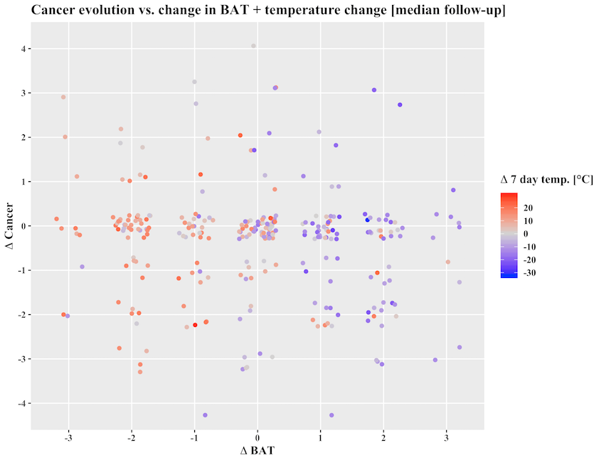
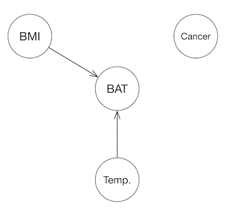

# Paper Repository: Brown Fat Does Not Cause Cachexia in Cancer Patients 

  <!-- badges: start -->
  
  
  <!-- badges: end -->

by
Anton S. Becker, M.D., Ph.D.1,2,3, 
Caroline Zellweger, M.D.3, 
Sara Bacanovic, M.D.3, 
Sabine Franckenberg, M.D.2, 
Hannes W. Nagel, M.D.3, 
Lukas Frick, M.D.4, 
Khoschy Schawkat, M.D.2, 
Matthias Eberhard, M.D.2, 
Christian Blüthgen, M.Sc.2, 
Jörk Volbracht, M.D.5, 
Rudolf Moos, M.D.5, 
Christian Wolfrum, Ph.D.†1, 
Irene A. Burger, M.D.†3

† Equal contribution/shared senior authorship

> Affiliations:
> 1.	Department of Health Sciences and Technology; Institute of Food, Nutrition and Health, ETH Zurich, Schorenstrasse 16, Schwerzenbach, Switzerland
> 2.	Institute of Diagnostic and Interventional Radiology, UniversityHospital Zurich, Raemistrasse 100, Zurich, Switzerland
> 3.	Department of Nuclear Medicine, UniversityHospital Zurich
> 4.	Department of Pathology and Molecular Pathology, UniversityHospital Zurich
> 5.	Division of Controlling and Data Management, UniversityHospital Zurich

This paper has been published in [PLOS ONE](https://doi.org/10.1371/journal.pone.0239990).

> In this large retrospective longitudinal cohort study, we examined whether brown adipose tissue (BAT)
> has a role in cancer cachexia. We found that there is no association between Cancer, BAT and weight loss.
> Differences in baseline outside temperature were the main driver of BAT activity.

*Scatterplot, each point corresponds to the difference between two examinations in a single patient.*

> Causal inference analysis confirmed these results (BAT activity caused by low temperatures).
> Furthermore, weight loss probably causes BAT activity (loss of thermal insulation), and not the other way around.

*Directed acyclic graph generated from our data, showing the probable causal directions*

## Abstract

### Background 
Brown adipose tissue (BAT) is a specialized form of adipose tissue, able to increase energy expenditure by heat generation in response to various stimuli. Recently, its pathological activation has been implicated in the pathogenesis of cancer cachexia. To establish a causal relationship, we retrospectively investigated the longitudinal changes in BAT and cancer in a large FDG-PET/CT cohort.
### Methods 
We retrospectively analyzed 13 461 FDG-PET/CT examinations of n = 8 409 patients at our institution from the winter months of 2007-2015. We graded the activation strength of BAT based on the anatomical location of the most caudally activated BAT depot into three tiers, and the stage of the cancer into five general grades. We validated the cancer grading by an interreader analysis and correlation with histopathological stage. Ambient temperature data (seven-day average before the examination) was obtained from a meteorological station close to the hospital. Changes of BAT, cancer, body mass index (BMI) and temperature between the different examinations were examined with Spearman’s test and a mixed linear model for correlation, and with a causal inference algorithm for causality.
### Results
We found n=283 patients with at least two examinations and active BAT in at least one of them. There was no significant interaction between the changes in BAT activation, cancer burden or BMI. Temperature changes exhibited a strong negative correlation with BAT activity (ϱ=-0.57, p<0.00001). These results were confirmed with the mixed linear model. Causal inference revealed a link of Temperature :arrow_right: BAT in all subjects and also of BMI :arrow_right: BAT in subjects who had lost weight and increased cancer burden, but no role of cancer and no causal links of BAT :arrow_right: BMI.
### Conclusions
Our data did not confirm the hypothesis that BAT plays a major role in cancer-mediated weight loss. Temperature changes are the main driver of incidental BAT activity on FDG-PET scans.

## Software implementation

The analysis was run in R 4.0.2. We also recommend using the latest version of RStudio.

## Getting the code

You can download a copy of all the files in this repository by cloning the
[git](https://git-scm.com/) repository:

    git clone https://github.com/ASBecker/BATcancer.git

or [download a zip archive](https://github.com/ASBecker/BATcancer/archive/master.zip).

## Dependencies

You'll need a working R environment to run the code.
The recommended version is R 4.0.0, together with the latest version of RStudio.
The required dependencies will be installed automatically when running `prep.R` 
and/or `R_notebook.Rmd` for the first time using the `install.load` package.

## Reproducing the results

Knitting `Presentation/R_notebook.Rmd` will yield a html file containing the main results 
of the analysis, running the chunks in RStudio allows for access to the data and additional 
inspection/analysis.

Alternatively, you can run the analysis on [Binder](https://mybinder.org/v2/gh/ASBecker/BATcancer/master?urlpath=rstudio) 
in an online instance of RStudio server.
This analysis is powered by the [holepunch package](https://github.com/karthik/holepunch).

## License

All source code is made available under a BSD 3-clause license. You can freely
use and modify the code, without warranty, so long as you provide attribution
to the authors. See `LICENSE.md` for the full license text.
